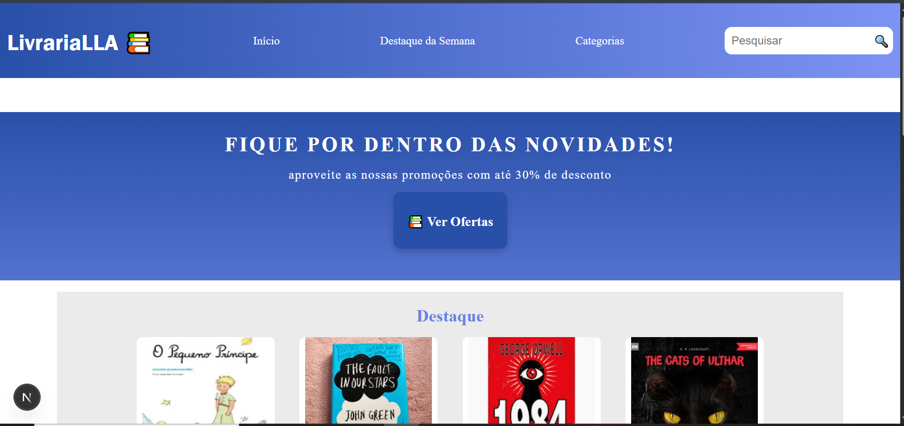

# Livraria LLA 📚📒

Este é um projeto de uma livraria virtual desenvolvido com Next.js e React, voltado para a construção de interfaces modernas e dinâmicas.

## Tecnologias utilizadas 🚀

- React - Biblioteca para criação de interfaces de usuário
- Next.js -Framework para React com suporte a SSR e SSG
- CSS - Estilização da aplicação

## Funcionalidades 📌

📖 Catálogo de livros

🔍 Pesquisa por títulos

🛒 Carrinho de compras

⭐ Avaliação de livros

## Pré Requisitos

Antes de começar, você precisará ter instalado em sua máquina:

Node.js (versão recomendada: 18 ou superior)

npm ou Yarn

## Como instalar 💻

Clone o repositório para a sua máquina.

```bash
git clone https://github.com/PedroLeoo07/LivrariaLLA
```

Entre na pasta do projeto e instale as dependências.

```bash
cd LivrariaLLA
npm install
```

## Como executar 💻

Execute o comando para iniciar o servidor de desenvolvimento.

```bash
npm run dev
```

Acesse a aplicação em [localhost:3000](http://localhost:3000).

## Como contribuir 🤝

1. Fork o repositório.
2. Crie uma branch com a nova feature: `git checkout -b nova-feature`.
3. Faça o commit da sua nova feature: `git commit -m 'Adiciona nova feature'`.
4. Faça o push da sua branch: `git push origin nova-feature`.
5. Crie um Pull Request para o repositório original.

## Captura de Tela 🎨


## Autores 👨🏼‍💻
**Leonardo Oliveira**
<br/>
**Lucas Zani**
<br/>
**André Lucca**
